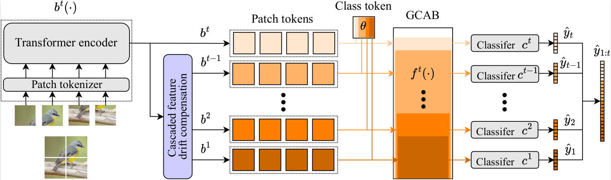
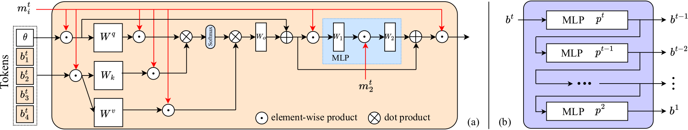

# Exemplar-free Continual Learning of Vision Transformers via Gated Class-Attention and Cascaded Feature Drift Compensation
[Marco Cotogni](https://scholar.google.com/citations?user=8PUz5lAAAAAJ&hl=it), [Fei Yang](https://scholar.google.com/citations?hl=it&user=S1gksNwAAAAJ), [Claudio Cusano](https://scholar.google.com/citations?hl=it&user=lhZpU_8AAAAJ), [Andrew D. Bagdanov](https://scholar.google.com/citations?hl=it&user=_Fk4YUcAAAAJ) and [Joost van de Weijer](https://scholar.google.com/citations?hl=it&user=Gsw2iUEAAAAJ)

ArXiv version of our [Paper](https://arxiv.org/pdf/2211.12292.pdf) is available.


## Running code
In order to use our code, it is possible to create a conda environment using the requirements.txt file and Python 3.9.

For training the model please run:
```
python3 main.py --options options/data/DATASET_SCENARIO options/data/DATASET_ORDER 
options/model/DATASET_GCAB_FDC --name GCAB --data-path PATH 
--output-basedir OUTPUTDIR --compress COMPRESS_FILE.txt --report REPORT

```
For evaluating the trained model:
```
python3 main.py --options options/data/DATASET_SCENARIO options/data/DATASET_ORDER 
options/model/DATASET_GCAB_FDC --name GCAB --data-path PATH 
--output-basedir OUTPUTDIR --compress COMPRESS_FILE.txt --report REPORT 
--resume PATH_TO_THE_MODEL --eval

```


### Reference
If you are considering using our code or you want to cite our paper please use:

```
@article{cotogni2022gated,
  author = {Cotogni, Marco and Yang, Fei and Cusano, Claudio and Bagdanov, Andrew D. and van de Weijer, Joost},
  title = {Gated Class-Attention with Cascaded Feature Drift Compensation for Exemplar-free Continual Learning of Vision Transformers}, 
  journal={arXiv preprint arxiv:2211.12292},
  year={2022}
}

```
#### Credits
Our code is based on:

[DyToX](https://github.com/arthurdouillard/dytox)
[HAT](https://github.com/joansj/hat)
